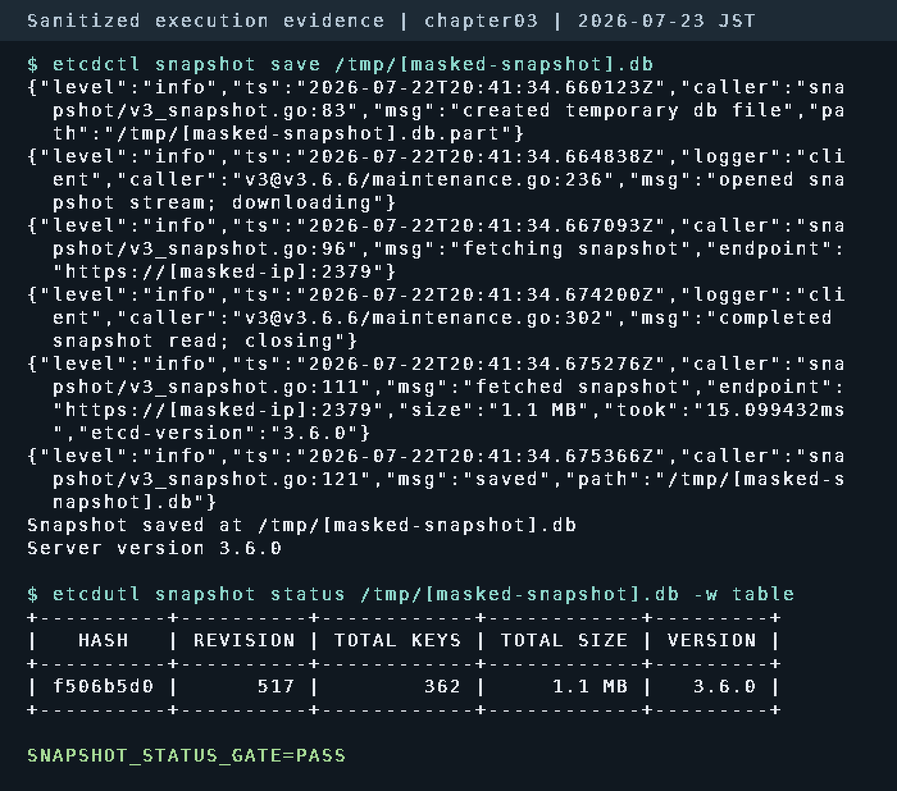

# 第3章：etcd設計とバックアップ

etcd は Kubernetes のクラスタ状態を保持する基盤であり、障害時の復旧性と性能に直結します。本章では、トポロジ選択とバックアップ/リストアの運用観点を整理します。

## 学習目標
- etcd の役割と、障害時に起きる影響を説明できる
- トポロジ（stacked / external）選択の論点を整理できる
- バックアップ/リストアを運用物として定義し、演習計画を立てられる

## 扱う範囲 / 扱わない範囲

### 扱う範囲
- etcd の役割（状態保存、整合性）
- トポロジの選択（stacked / external）
- バックアップ（snapshot）とリストアの考え方
- 運用指標（容量、レイテンシ）とアラート

### 扱わない範囲
- etcd の詳細なチューニングパラメータの網羅
- すべての障害シナリオ

## 定義（この章の用語）
- snapshot: etcd の特定時点の状態を保存したもの（バックアップの代表的な手段）
- RPO/RTO: 目標復旧時点/目標復旧時間。バックアップ頻度と復旧手順の要件になります。

## 背景（なぜ重要か）
- etcd が劣化すると API 全体が遅くなり、障害対応や運用作業が進まなくなります。
- 「バックアップがある」だけでは不足で、復旧できること（リストア演習と所要時間の把握）が必要です。

## etcd が持つもの
- Kubernetes API オブジェクト（metadata/spec など）
- 状態変更の履歴（watch 等に影響）

注意:
- 大きすぎるオブジェクトや高頻度の書き込みは、etcd に負荷をかけます。

## トポロジ選択（概略）

### stacked etcd
- Control Plane ノード上で etcd を動かします。
- 構成が単純ですが、障害ドメインが近くなります。

### external etcd
- etcd クラスタを Control Plane と分離します。
- 障害分離はできますが、運用対象が増えます（監視、バックアップ、証明書等）。

## 手順/例：バックアップ/リストア運用の型
1. RPO/RTO を前提に、バックアップ頻度と保持期間を決める
2. バックアップの取得（自動化）と成功判定（監視/アラート）を用意する
3. 保管先を分離し、暗号化とアクセス権を標準化する（単一障害点を避ける）
4. リストア手順を Runbook 化し、検証環境で定期的に演習して所要時間を記録する

## バックアップ/リストア（運用観点）
- バックアップの頻度（RPO）と保持期間
- 取得方法（スナップショット、暗号化、保管先）
- リストア手順（検証環境での演習）
- 復旧手順とエスカレーション

### 復旧演習ゲート
`etcdctl snapshot save` の成功や `etcdutl snapshot status` の表示は、リストア完了を保証しません。Runbook には少なくとも次を含めます。

| 観点 | 確認内容 |
| --- | --- |
| 取得証跡 | snapshot ファイル、取得時刻、etcd / etcdutl version、対象 endpoint、証明書パス、保存先を記録する |
| 保管 | snapshot を Control Plane ノード外へ退避し、暗号化、改ざん防止、最小権限、保持期間を定義する |
| リストア演習 | 本番とは分離した検証環境で restore し、API Server の疎通、主要 namespace / CRD / 代表ワークロードを確認する |
| 変更連動 | Kubernetes / etcd / 証明書 / static Pod manifest の変更時は、バックアップと restore Runbook を再検証する |
| 責任分界 | マネージド Control Plane では etcd snapshot を直接扱えない場合があるため、ベンダ提供のバックアップ/復旧責任範囲を確認する |

### 最小実行例（単一 Control Planeのkubeadm stacked etcd）
前提:
- **単一 Control Plane、単一local member**で、kubeadm が管理する stacked etcd の static Pod を対象とする
- endpoint は `https://127.0.0.1:2379`、証明書は kubeadm 既定の `/etc/kubernetes/pki/etcd/` を使う
- 本番 restore は API Server 停止計画とセットで扱い、まず検証環境で演習する
- external etcd とマネージド Control Plane はこの手順の対象外とし、それぞれの製品・運用者が定める手順を使う
- 複数 Control Plane のHA stacked etcdはこの最小例の対象外とする。HA構成では1 memberだけを差し替えず、同じsnapshotから全memberを復元して新しいlogical clusterとして起動する手順を、対象etcd版の公式disaster recovery手順に基づいて設計する

```bash
export ETCDCTL_API=3

etcdctl \
  --endpoints=https://127.0.0.1:2379 \
  --cacert=/etc/kubernetes/pki/etcd/ca.crt \
  --cert=/etc/kubernetes/pki/etcd/healthcheck-client.crt \
  --key=/etc/kubernetes/pki/etcd/healthcheck-client.key \
  snapshot save /var/backups/etcd/snapshot.db

etcdutl snapshot status /var/backups/etcd/snapshot.db -w table

# 例: etcd.yaml の値をそのまま転記する
ETCD_NAME="<etcd.yaml の --name>"
ETCD_INITIAL_CLUSTER="<etcd.yaml の --initial-cluster>"
ETCD_INITIAL_ADVERTISE_PEER_URLS="<etcd.yaml の --initial-advertise-peer-urls>"
ETCD_INITIAL_CLUSTER_TOKEN="<復旧単位で一意な新しいtoken>"
# snapshot取得後に増え得たrevision数の安全側上限を、書き込み率と経過時間から事前検証して設定する
REVISION_BUMP="${REVISION_BUMP:?set a validated revision increment before restore}"

etcdutl \
  snapshot restore /var/backups/etcd/snapshot.db \
  --name "${ETCD_NAME}" \
  --initial-cluster "${ETCD_INITIAL_CLUSTER}" \
  --initial-advertise-peer-urls "${ETCD_INITIAL_ADVERTISE_PEER_URLS}" \
  --initial-cluster-token "${ETCD_INITIAL_CLUSTER_TOKEN}" \
  --bump-revision "${REVISION_BUMP}" \
  --mark-compacted \
  --data-dir /var/lib/etcd-from-backup
```

Kubernetesのcontrollerやoperatorはwatch/informer cacheを利用するため、snapshot時点へのrevision巻き戻りが状態不整合を招くことがあります。対象etcd版で`--bump-revision`と`--mark-compacted`が利用できることを確認し、書き込み率とsnapshotからの経過時間に基づく安全側のincrementを検証環境で決めます。値を未設定のまま実行できない例にしているため、固定値を無条件に転用しないでください。restoreはmember IDとcluster IDを更新し、新しいlogical clusterを作る操作として扱います。

restore 後の最小反映（kubeadm stacked etcd）:
1. `/etc/kubernetes/manifests/etcd.yaml` の`name: etcd-data`に対応する`hostPath.path`を`/var/lib/etcd-from-backup`へ差し替えます。作業用ファイルとbackupは`/etc/kubernetes/manifests`の**外**（同じfilesystem上）へ置き、YAMLと差分を検証してからatomic renameで対象ファイルへ反映します。kubeletは監視対象内のdotで始まらない全ファイルを読むため、`etcd.yaml.bak`や`etcd.yaml.tmp`を同ディレクトリへ置いてはいけません。

   ```bash
   sudo install -d -o root -g root -m 0700 /etc/kubernetes/etcd-restore-work
   sudo cp --preserve=mode,ownership,timestamps \
     /etc/kubernetes/manifests/etcd.yaml \
     /etc/kubernetes/etcd-restore-work/etcd.yaml
   sudoedit /etc/kubernetes/etcd-restore-work/etcd.yaml
   # YAMLとhostPathの差分を運用環境のvalidatorで確認してから、同一filesystem上でatomic renameする
   sudo mv --force /etc/kubernetes/etcd-restore-work/etcd.yaml \
     /etc/kubernetes/manifests/etcd.yaml
   ```

2. kubelet は `/etc/kubernetes/manifests` を監視しており、manifest の変更を検知すると etcd の static Pod を自動的に再作成します。したがって、manifest の再読込だけを目的に `systemctl restart kubelet` を実行してはいけません。
3. API Serverが復帰するまでは`crictl ps -a --name etcd`と`journalctl -u kubelet`でlocal containerとstatic Pod再作成を監視します。API Serverの疎通が戻った後、別端末で次のPod確認を実行し、変更前に記録したUIDと比較します。static Podのmirror Podは同じ名前で再作成されることがあるため、名前だけでなくUID、作成時刻、Ready状態を確認します。API Server停止中は`kubectl`による確認が失敗し得るため、local runtimeの確認を省略しません。

   ```bash
   sudo crictl ps -a --name etcd
   journalctl -u kubelet -n 200 --no-pager
   ```

   ```bash
   kubectl -n kube-system get pod -l component=etcd \
     -o custom-columns='NAME:.metadata.name,UID:.metadata.uid,CREATED:.metadata.creationTimestamp,READY:.status.containerStatuses[0].ready' \
     --watch
   ```

4. etcd Pod の再作成後、Ready 状態を確認し、snapshot restore に使用した証明書で endpoint の health と status を確認します。

   ```bash
   ETCDCTL_API=3 etcdctl \
     --endpoints=https://127.0.0.1:2379 \
     --cacert=/etc/kubernetes/pki/etcd/ca.crt \
     --cert=/etc/kubernetes/pki/etcd/healthcheck-client.crt \
     --key=/etc/kubernetes/pki/etcd/healthcheck-client.key \
     endpoint health

   ETCDCTL_API=3 etcdctl \
     --endpoints=https://127.0.0.1:2379 \
     --cacert=/etc/kubernetes/pki/etcd/ca.crt \
     --cert=/etc/kubernetes/pki/etcd/healthcheck-client.crt \
     --key=/etc/kubernetes/pki/etcd/healthcheck-client.key \
     endpoint status -w table
   ```

5. local runtimeのetcd containerログで起動失敗、データディレクトリ、証明書、peer/client endpointのエラーがないことを確認します。API Server復帰後はmirror Pod名を取得し、`kubectl logs`でも同じ観点を確認します。

   ```bash
   ETCD_CONTAINER="$(sudo crictl ps -a --name etcd --quiet | head -n 1)"
   test -n "$ETCD_CONTAINER"
   sudo crictl logs "$ETCD_CONTAINER"

   ETCD_POD="$(kubectl -n kube-system get pod -l component=etcd -o jsonpath='{.items[0].metadata.name}')"
   kubectl -n kube-system logs "$ETCD_POD" -c etcd --since=10m
   ```

6. API Server、Controller Manager、Scheduler の再起動要否を Runbook に含めます。etcd の復旧によって各コンポーネントが自動的に復帰するかを確認し、不要な一括再起動は避けます。

#### manifest 監視が働かない場合の fallback

manifest の変更後も Pod の UID が変わらず、Pod、health、log の確認で変更が反映されていないと判断した場合だけ、kubelet の監視障害を診断します。まず次を確認します。

```bash
stat /etc/kubernetes/manifests/etcd.yaml
systemctl is-active kubelet
journalctl -u kubelet -n 200 --no-pager
```

manifest のパス、所有者・権限、YAML の妥当性、kubelet が参照する `staticPodPath`、および kubelet ログの manifest 読み込みエラーを切り分けます。原因と影響範囲を記録し、停止窓を承認したうえでなお監視が復旧しない場合に限り、`systemctl restart kubelet` を fallback として実施します。restart 後も Pod の再作成、Ready、`endpoint health`、`endpoint status`、ログを同じ順序で再確認してください。

再読込だけを理由に kubelet を再起動すると、kubelet が管理する他の Control Plane static Pod にも影響して API の停止窓を広げる可能性があります。etcd のリストア自体が API Server の停止を伴う場合でも、不要な kubelet restart を重ねると可用性リスクと切り戻しの複雑さが増すため、manifest 監視による自動反映を第一選択にします。

### 実行証跡：etcd snapshotの保存・server version・hash・revision・sizeを判断する出力 {#figure-ch03-etcd-snapshot-status-01}



_2026-07-23（JST）取得。Ubuntu 24.04 GitHub-hosted runner、Kubernetes 1.35.0、kubectl 1.35.1、kind 0.31.0。etcdctlの保存完了とetcdutl statusのhash、revision、key数、size、version、PASS markerを見て、復旧演習へ渡せるsnapshotか判断します。_

## 注意点（運用）
- リストアはクラスタ停止を伴う場合があります。実施条件、影響範囲、判断責任者を事前に定義してください（要確認）。
- バックアップの保管先（オブジェクトストレージ等）も障害します。可用性とアクセス制御を設計に含めます。
- トポロジ（stacked / external）の選択は、障害分離と運用負荷のトレードオフです。組織の運用体制に合わせて決めます。

注意:
- `etcdctl snapshot restore` は etcd v3.5 で非推奨、v3.6 で削除済みのため、restore/status は `etcdutl` 前提で記述します。
- この節のmanifest反映とkubelet restart fallbackは、**単一 Control Planeのkubeadm stacked etcd**に限定します。HA stacked etcd、external etcd、マネージド Control Planeには適用せず、全member復元、新しいlogical cluster、証明書、manifest、再起動、可用性の責任分界を含む各構成の手順を使用します。

## 実務チェック観点（最低5項目）
- RPO/RTO とバックアップ頻度が整合している
- バックアップの保管先が単一障害点になっていない
- リストア演習が定期的に実施され、所要時間が記録されている
- etcd の容量/レイテンシに基づくアラートがある
- バージョンアップ時の互換性と手順が定義されている

## よくある落とし穴
- バックアップは取っているが、リストア手順がない/演習がない
- etcd 容量の監視がなく、上限に近づいてから気付く

## まとめ / 次に読む
- 次に読む: [第4章：ノード/ランタイム運用](../chapter04/)
